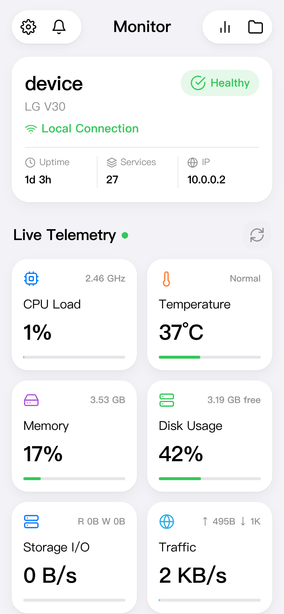

# gumonitor

把一台 2017 年的旧手机（LG V30 / `joan`，postmarketOS edge，aarch64）变成常驻遥测节点。
UI 参考 Open Pi 的风格：iOS 式分组卡片 + 实时折线图 + 详情页。

两个特点：服务端是**纯 Python 标准库**（零第三方依赖，设备上装包很麻烦），
前端是**零依赖原生 JS + 手写 SVG**。传感器侧能拿到的比多数桌面工具还细 ——
`pmi8998-fg` 的 fuel-gauge、`pmi8998-rradc` 的外壳/充电芯片温度、
`usbin` 输入侧功率、zram 压缩比、UFS 的 I/O 繁忙度。

> **适用范围**：读的全是 `/proc`、`/sys` 这类标准接口，所以框架本身在任何 Linux 上都能跑；
> 只是**具体采集项是按这台机器挑了传感器**的（Qualcomm PMIC、UFS、zram…）。
> 换台设备大概率要改 `server.py` 里的采集函数 —— 改起来不复杂，每个函数都只读几个文件。



## 它是什么

一个只读遥测服务：每秒从 `/proc`、`/sys` 采样一次，写进 300 点环形历史，
再用一个极简 HTTP 服务把「当前快照 + 各序列历史」发给前端。

```
/proc /sys ──► server.py ──► HTTP :8090 ──► 浏览器
              （每秒采样）    （前端每秒拉 /api/state）
```

服务本身**只管监听一个端口**，对进程管理器、防火墙都没有要求。
怎么让外面访问到它跟项目无关：直接开端口也行，挂到已有的 80/443 反代子路径下也行
（本项目开发时用的是后者）。两种写法见下面「部署」。

## 仓库结构

| 路径 | 是什么 |
| --- | --- |
| `server.py` | 采集 + HTTP 服务。纯 Python 标准库，零第三方依赖 |
| `static/` | 前端三件套（index.html / app.css / app.js）。零依赖原生 JS，图表是手写 SVG |
| `examples/` | 部署参考模板：systemd 用户服务、nginx 子路径反代、幂等安装脚本 |
| `tests/` | Playwright 端到端回归（41 项断言）+ 一份脱敏的真机样例快照 |

> 前端**所有资源和接口都用相对路径**（`app.css` / `app.js` / `api/state`），
> 所以不管挂在 `/monitor/` 这种子路径下、还是直连 `:8090/`，都不用改代码。

## 前端实现要点

### 图表选点（钉住）

点/拖图表会**钉住**某一时刻的样本：气泡显示该时刻的值与 `HH:MM:SS`，竖线变实线，
气泡上出现 **Live** 按钮，点它才回到实时；再点一次同一个样本也能解除。

两个必须记住的坑：

* **选中的位置只能存时间戳，不能存数组下标。** 历史是环形缓冲，每秒新样本进来
  整个数组左移一位，同一个下标下一秒就是另一个样本 —— 表现就是"刚点中的点自己
  变了 / 马上弹回最新"。`pinTs` / `hoverTs` 存时间戳，每次重绘用 `resolveTs()` 反解下标，
  样本滚出 5 分钟窗口后自动放开。
* **`pointerleave` 只清悬停，绝不清钉住。** 手指抬起同样会派发 `pointerleave`，
  以前在这里清 cursor，就是"点一下立刻弹回最新"的根因。

### 详情页数值一律用 fresh，不要用 spec

`updateDetail()` 里 `METRICS[id].detail(DATA, DATA.series)` 每次轮询都会重算一份
`fresh`。**渲染只准用 fresh**，`currentDetail.spec` 是打开页面那一刻的快照 ——
用它渲染会出现"小图在动、百分比数字永不动"（逐核占用率曾经就是这样）。
同理：卡片上只存**索引**（`data-core`），别把带数值的对象缓存到 DOM 节点上。
## 采集了哪些数据

| 卡片 | 数据来源 | 详情页 |
| --- | --- | --- |
| CPU Load | `/proc/stat` 每秒差值，逐核 + 总 | 总负载折线（阈值 80/95）+ 8 个核心卡（各自迷你折线）|
| Temperature | `thermal_zone0` = `pm8998-thermal` | 折线（应用阈值 65/80）+ 分区温度 + 内核 trip point（105/125 被动/临界）|
| Memory | `/proc/meminfo` | 占用率折线 + Total/Used/Cached/Buffers/Swap + PSI |
| Disk Usage | `statvfs('/' '/boot' '/data')` | 占用率折线 + 各挂载点用量 |
| Traffic | `/proc/net/dev` wlan0 差值 | 下载/上传双折线 + 累计收发 + IP + **WiFi 链路**（SSID/信号/信道/协商速率，来自 `nmcli`）|
| Storage I/O | `/proc/diskstats` 的 `sda`（UFS）差值 | 读/写双折线 + IOPS + 繁忙% + 累计读写 |
| Link Quality | `/proc/net/snmp` 的 `Tcp:` + `wlan0/statistics` | 重传率折线 + TCP 连接数 + 丢包/错包/断连次数 |
| Battery | `fuel-gauge`（pmi8998-fg）+ `pmi8998-charger` | **功率双折线（整机 + 电池端）** + 电流副图 + 状态/电压/电流 + **充电详情** + 温度/健康度/估算续航 |
| System Load | `/proc/loadavg`、`/proc/pressure`、`systemctl` | load 折线 + 内核/系统/服务数 + Top5 进程 |

此外 Memory 详情页带 **Zram**（压缩比/节省量/交换速率），Temperature 详情页带
**IIO rradc** 的 skin / chg 温度点（`thermal_zone` 里只有 SoC 和电池两个）。

### 存储 I/O 只统计 `sda`

`/` 挂在 `loop0` 上，而 `loop0` 的 `backing_file` 是 `/dev/sda18` ——
所有 I/O 最终都落到物理盘 `sda`（UFS `THGAF4G9N4LBAIRB`），
所以**只统计 sda**，不能再把 `loop0` 加进来（那是重复计数）。

### WiFi 走 nmcli，必须低频

内核没编 WEXT（`iwconfig wlan0` 返回 `no wireless extensions`），
拿信号强度只能走 `nmcli dev wifi list`。实测一次约 **30ms**，
所以后端**每 10 秒**采一次并缓存（`WIFI_EVERY`），不要放进 1 秒循环里。
`--rescan no` 也必须带 —— 不加的话每次调用都会触发一次主动扫描。

### 整机功耗怎么算（别直接用电池端功率）

电池端 `V × I` **只在放电时**等于整机功耗。插着电时系统吃的是 VBUS，
电池端会小到接近 0 —— 尤其是 `charge_behaviour=inhibit-charge` 这种"插着却不充"的状态，
实测电池端只有 **0.013 W**，而 VBUS 输入是 `5.08 V × 106 mA = 0.54 W`。

所以统一按这个公式算（`server.py` 里的 `system_power`）：

```
整机 = max(0, 输入功率 − 充入电池的功率) + 电池放出的功率
输入功率 = rradc 的 usbin_v × usbin_i（仅 charger.online 时采用，且 > 50mW）
```

三个场景都对：纯放电 → 电池输出；插电充电 → 输入减充入；插电但电池也在补放电 → 两者相加。

**注意充电时这个差值里还含充电回路的损耗**（buck + 充电 IC + 电池内阻，效率通常 85~90%），
所以会比"纯系统功耗"偏高一点 —— 这是这套传感器的精度上限，不是 bug。
配套的 `Charging Efficiency = 充入电池 / 输入` 就是把这个损耗量化出来。

界面上两个数分开列：`System Power`（整机）与 `Battery Power`（电池端），避免混为一谈。

Battery 详情页把这两个量画在**同一张图**上（黄 = System，绿 = Battery），
因为它们的关系本身就是信息：

* **放电时两条线几乎重合** —— 电池就是整机唯一的电源，这很正常，不是画错了；
* **充电时两条线分开**，而且分开的方向相反：电池端在充入（数值大），整机只占输入的一小部分。
  实测充电中：电池端 `4.34 W`、整机 `0.65 W`、输入 `4.99 W` —— 效率 87%；
* **插电但充电被抑制时**（`inhibit-charge`），电池端接近 0 而整机不为 0 ——
  一眼就能看出"电是 USB 在供，不是电池在放"。

图例做成**压在图表右上角的小气泡**（每项一小段线 + 名字），不占竖直空间。
两个实现要点：

* `pointer-events: none` —— 否则图例会挡住它下面那块曲线的点选/拖动；
* 线段样例用曲线的**真实样式**（颜色 + 实线）。只在图例里画虚线而曲线是实线，
  会让人在图上找不出哪根是虚线，属于自找麻烦。

### Power Draw 已合并进 Battery（2026-09-14）

两者用的是**同一份数据源**（`pmi8998-fg` 的 `voltage_now × current_now`），
详情页字段几乎全重复（电压/电流/方向/两个 5 分钟均值）。
现在合并成一张 Battery 卡：磁贴大字 = 电量、灰字 = 功率 + 方向；
详情页主图 = 功率、副图 = 电流（mA 和 W 差两个数量级，画在一起会互相压平）。
「5-Minute Stats」面板里的 `Power Draw` 行保留 —— 那是对**序列**的统计，不是卡片。

应用层建议阈值写在 `server.py` 顶部（`TEMP_WARNING/CRITICAL`、`CPU_WARNING/CRITICAL`），
与内核 trip point 分开呈现，不混为一谈。

### 关于「Power Draw」不是 Core Power

v30 上**没有 SoC / Core / rail 级功率传感器**：

* 没有 `hwmon`，`power_supply` 也没有 `power_now`；
  （IIO 上其实有 `usbin_v` / `usbin_i`，能算**输入侧**功率，但拔电即为 0，
  而且 PMIC 的 ADC 精度一般，没拿它当主指标）
* 唯一能测的功率 = 电池端 fuel-gauge（`pmi8998-fg`）的 `voltage_now × current_now`，
  也就是**整机**从电池取用/充入的功率，不是 CPU/SoC 单独功耗。

所以卡片叫 **Power Draw** 而非 Core Power。符号约定：**正 = 充入，负 = 放出**，
电流同理（`current_now` 在放电时读数为正，方向由 `status` 字符串判定后统一转成带符号值）。
**这个符号只存在于接口里**：界面上一律显示绝对量，方向改由 `In` / `Out` / `Idle` 文字标注
（`flowWord()`）。对带符号序列求平均必须用 `avgMag()`（先取绝对值再平均），
直接求平均会在方向翻转时互相抵消。

## 卡片文案原则：大字给合计，小灰字给拆分

磁贴/详情页的**大字是"一个数"**，需要拆分的信息放小灰字，别让大字只承担一半含义：

* Traffic 的大字 = **上行 + 下行合计**；右上角灰字单行给出 `↑ 上行 ↓ 下行`。
  （详情页同理：大字合计，紧随其后的灰字状态行再拆成 `↓ 下载 · ↑ 上传`。）
* Power Draw / Battery 的大字是**绝对量**（不带 `+` / `−`），方向用灰字 `In` / `Out` / `Idle` 标注。
* **界面文案一律英文**（`Settings` / `Alerts` / `5-Minute Stats` / `History Window` /
  `Avg Power (5 min)` …），不要中英混排；中文只出现在代码注释和本文档里。
  `verify.mjs` 有 CJK 嗅探断言防回归。

### 为什么 Traffic 的灰字要用紧凑单位（K/M/B）

磁贴灰字的可用宽度非常小 —— 实测 320px 视口只有 74px，360px 时 95px，
390px 时 110px，412px 时 121px，480/492px 时 155px。
而「↑ 12 KB/s ↓ 3.4 MB/s」两边各写一次完整单位要 **156px**，
**连最宽的 492px 都放不下**（差 1px）。上下行单位还经常不同
（下载 MB/s、上传 KB/s），也不能共用一个单位。

所以 `fmtRateTiny()` 把单位压成一个字母、数值压到最多 4 位
（`1023K` / `9.9M` / `987B`），宽度才有上界：

| 写法 | 宽度 | 360px | 390px | 412px | 480/492px |
| --- | --- | --- | --- | --- | --- |
| `↑ 12 KB/s ↓ 3.4 MB/s` | 156px | ✗ | ✗ | ✗ | ✗ |
| `↑ 12K ↓ 3.4M`（采用） | 89–110px | 常见值 ✓ | ✓ | ✓ | ✓ |

窄屏（≤419px）灰字字号降到 12.5px，让 360px 下常见值也能完整显示。
320px 仍然放不下 —— 那个宽度下原有的 `3.20 GB free` 等灰字本来就会溢出，不在支持范围。

> 曾试过把上下行写成两行（`.tile .badge { white-space: pre-line }` + `\n`），
> 虽然宽度安全，但磁贴被撑高 18px、整行磁贴比其他行高一截，观感更差，已弃用。

**⚠️ 别让灰字超宽**：`.tile` 在 `grid-template-columns: 1fr 1fr` 里，而 `1fr`
的 min 是 min-content —— 灰字放不下时会**把网格轨道撑宽**，整块横向溢出，
再被 `#app { overflow-x: clip }` 裁掉，右列内容就直接看不见了
（不是出现滚动条，所以很容易漏掉）。
排查脚本：`tests/probe-tiles.mjs`（列出每块磁贴灰字宽度 vs 预算 + 网格是否溢出），
改灰字文案前先跑 `tests/probe-badge.mjs` 量一下放不放得下。

### 磁贴渲染要有逐块兜底

`updateTiles()` 里每块磁贴单独 `try/catch`。否则任何一个指标算错
（曾经因为引用了不存在的函数）都会让**循环在那一块中断，后面所有磁贴停在
初始的「—」**上 —— 这种"静默半死"从截图上很难看出来。

## 滚动与 overflow：一条硬规矩

**永远不要给 `html, body` 加 `overflow-x: hidden`。**

给 html/body 设 `overflow-x: hidden` 会让 `overflow-y` 的计算值从 `visible` 变成 `auto`，
也就是**把 `body` 变成一个滚动容器**。而 `body` 上带着 `overscroll-behavior-y: none`
（用来关掉移动端下拉刷新），它会**阻断滚动链**——鼠标滚轮 / 触屏拖动落在 `body` 区域后
再也传不到视口，整页就滚不动了。最阴的是 `window.scrollTo()` 依然有效，
只看这个会误判成"没问题"。

正确做法：

* 横向溢出由 `#app { overflow-x: clip }` 兜住。用 `clip` 而不是 `hidden`，
  因为 `clip` **不会**产生滚动容器，滚动链上少一个"死节点"。
* `overscroll-behavior-y: none` 只应该作用在**根滚动器**上。
* 详情页是 `position: fixed`，本来就不产生横向溢出，所以原来那条
  `overflow-x: hidden` 从一开始就是多余的。
* 滚动条隐藏靠 `scrollbar-width: none` + `::-webkit-scrollbar`，
  不要靠外层 `overflow: hidden` 去"关掉"它。

自查：`document.body` 的 `overflowY` 计算值应该是 `visible`（即不是滚动容器）。

## HTTP 接口

* `GET /` — 看板页面
* `GET /api/state` — 一份完整快照 + 各序列的 5 分钟历史（前端每秒拉一次）
* `GET /api/health` — `{"ok":true}`
* 前端支持深链：`#cpu`、`#temp`、`#memory`、`#disk`、`#io`、`#traffic`、`#netq`、`#battery`、`#system`

## 部署

**核心只有一件事**：把一个零依赖的 Python 脚本跑起来。

```sh
git clone <this-repo> && cd gumonitor
python3 server.py                      # 默认监听 0.0.0.0:8090
# 环境变量：V30_PORT / V30_INTERVAL(秒) / V30_HISTORY(点数) / V30_DISK(盘名)
```

它对 init 系统没有任何要求 —— 不是守护进程、不写 pid 文件、不依赖 cgroup，
只要 `python3`（3.11+）在，任何机器上都能跑。所以**下面的东西都只是"怎么让它开机自启 + 怎么访问"，按你的环境挑一套**。

### 让它开机自启

| 环境 | 做法 | 现成模板 |
| --- | --- | --- |
| systemd（含用户会话） | 装成**用户**服务，配合 `loginctl enable-linger` 可在未登录时也跑 | `examples/systemd-user.service` |
| OpenRC | `/etc/init.d/gumonitor` 写个 `command=`/`command_args=` 的骨架，`rc-update add gumonitor default` | — |
| runit / s6 | `run` 脚本里 `exec python3 /path/to/server.py` | — |
| Docker | `FROM python:3.13-alpine` + `CMD ["python3","server.py"]`（基础镜像自带 python，无需装包） | — |
| 懒得服务化 | `tmux` / `nohup` 一把梭，够用 | — |

### 怎么访问它

服务默认监听 `0.0.0.0:8090`，所以两条路：

1. **直接开端口**。如果设备有防火墙（`nft` / `iptables` / `ufw` 各不相同），加一条放行规则即可：
   ```sh
   nft    add rule inet filter input tcp dport 8090 accept      # nftables
   iptables -A INPUT -p tcp --dport 8090 -j ACCEPT              # iptables
   ufw    allow 8090/tcp                                        # ufw
   ```
2. **挂到已有的 80/443 反代子路径下**（不用碰防火墙规则；本项目开发时用的就是这个）。
   `examples/nginx-subpath.conf` 里有两个 location 块，配 `examples/install-nginx-snippet.sh`
   可以幂等地插进 nginx 配置（先 `nginx -t`，失败自动回滚）。Caddy / Traefik 同理。

   注意那个片段里 `proxy_pass` **结尾的斜杠**：它会把 `/monitor/` 前缀剥掉再转发，
   所以前端只用相对路径（`app.css` / `app.js` / `api/state`）—— 这也是为什么
   这份前端在任意子路径下都能直接用，不用改配置。

> 本项目开发时用的是一个私有的一键部署脚本（推送 → 装服务 → 写 nginx → 自检），
> 它绑定了那台设备的 IP、路径和 SSH 密码，属于环境特定，**没有放进仓库**。
> 上面这套 `examples/` + 上面的两段说明，等价于它做的事。

## 环境备忘（踩过的坑）

下面有若干条是**本项目的开发机或那台旧手机**的具体情况（写了"本机""设备"的即是），
不是通用结论；但踩坑本身的结论大多可以照搬。

* 本机无 `/dev/ptmx`，`sshpass` 用不了：一律 `SSH_ASKPASS + SSH_ASKPASS_REQUIRE=force + setsid`。
  另外本机 `/etc/ssh/ssh_config.d/*` 权限异常，ssh 要加 `-F /dev/null`。
* 设备时钟是 UTC（北京时间 −8h），前端时间轴按浏览器本地时区渲染。
* 设备上 `thermal_zone` 目录名解析别用固定下标切片（`thermal_zone` 是 12 个字符，
  切 11 会得到 `e0` 而 `int()` 崩溃）——见 `_trailing_number()`。
* sudo 需要密码：`printf '%s\n' "$PASS" | sudo -S -p '' sh -c '...'`。
* **前端回归全部在 `tests/` 里**（Playwright + 本机 Edge，41 项断言）：
  它能发**真实滚轮 / 真实触摸事件**、等真实渲染（不受 `--virtual-time-budget` 干扰）、
  支持任意视口。页面资源用 `page.route()` 从磁盘喂进去，不需要起 mock server、不占端口；
  数据来自 `tests/state.sample.json`（一份脱敏的真机快照），
  如果本地存在 `.workbuddy/state.json`（真机快照）就优先用它。
  ```sh
  cd tests && npm install && node verify.mjs   # 41 项断言，退出码非 0 即失败
  node probe-tiles.mjs                         # 每块磁贴灰字宽度 vs 预算、网格是否溢出
  node probe-badge.mjs                         # 比较候选文案放不放得下（改灰字前先跑）
  ```
  用 `EDGE=/path/to/msedge node verify.mjs` 指定浏览器（默认 `/opt/microsoft/msedge/msedge`）。
* **测滚动只能用真实输入。** `window.scrollTo()` 会骗人：它成功不代表用户能滚
  （详见上面「滚动与 overflow」一节的根因）。
* ⚠️ CDP 的 `Input.synthesizeScrollGesture({gestureSourceType:'touch'})` 在
  本机 Edge 152 上**是坏的**——在普通对照页上也返回 `scrollY=0`。
  触摸要用逐帧 `Input.dispatchTouchEvent`。任何合成输入方法都要先在极简对照页上
  验证有效，否则会把工具链的 bug 当成页面的 bug。
* 无头 Edge 截图的视口不跟 `--window-size` 等值走：宽恒为 `max(宽, 492)`、高 = `高 − 131`
  （只有裸 `--screenshot` 那条链路如此；Playwright 的 `viewport` 是精确的）。
  CDP 的页级命令在本机 Edge 上不响应。
* 另外两个土办法脚本没进仓库（本机私有）：`.workbuddy/shot2.sh`（截图，配 `trim.py` 裁白边）、
  `.workbuddy/run-diag.sh <脚本名>`（注入脚本 + `--dump-dom` 取结果）。它们踩过的坑值得留着：
  * `--virtual-time-budget` 快进 `setTimeout` 但**不推进 CSS transition** → 读
    `getComputedStyle` 拿到的是过渡**起始值**，会把"已关闭"读成"停在打开态"。
    要断言状态就上 Playwright，或先注入 `*{transition:none!important}`。
  * 注入脚本里写标记串（如 `DIAG_JSON=`）要用**拼接**构造，否则脚本源码本身
    也含这个字面量，dump 后被正则先匹配到，解析出的是源码。
  * 不同 Bash 调用之间可能看不到对方起的进程，固定端口会 `EADDRINUSE`
    （且旧进程还在服务旧代码，症状是"改了没生效"）——一律动态分配端口。
* 设备卡三列在窄屏会挤（V30 的 CSS 宽度只有 360~412px）：标签用
  `font-size: clamp(...)` 跟视口走，否则标签折行、IP 被省略号截掉。
